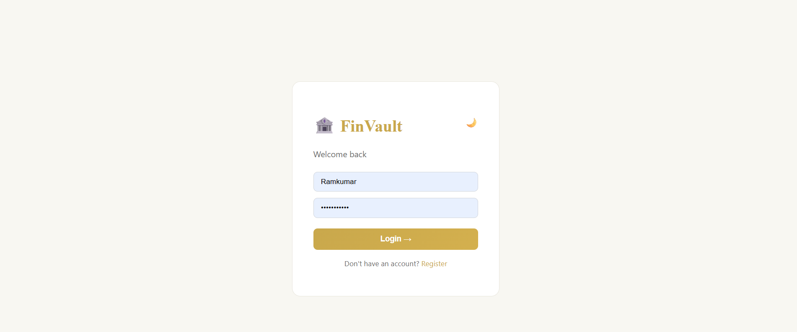
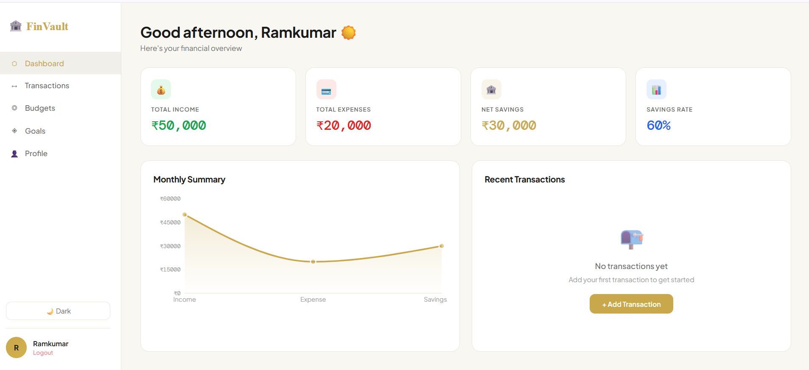
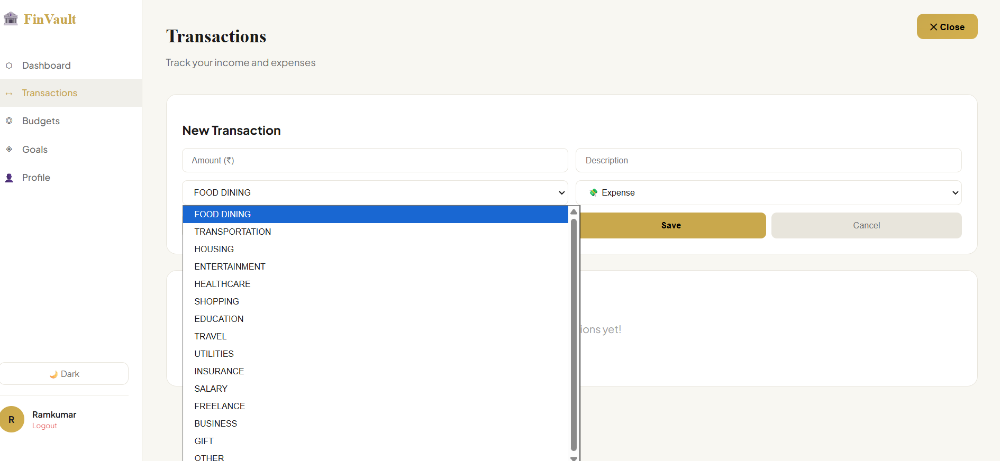
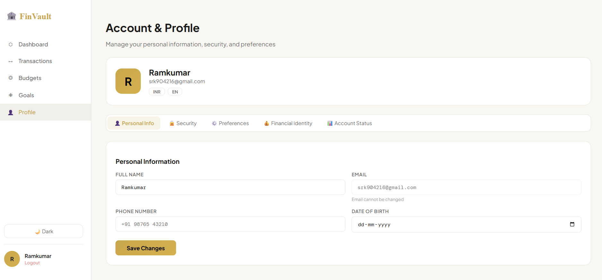

# 🏦 FinVault - Personal Finance Management


**FinVault** is a full-stack personal finance management application that helps users track transactions, manage budgets, set savings goals, and get AI-powered spending insights. Built with modern technologies and designed for scalability, it can be deployed locally using Docker or at scale on AWS EKS.

---

## 📋 Table of Contents

- [Features](#-features)
- [Tech Stack](#-tech-stack)
- [Architecture](#-architecture)
- [Project Structure](#-project-structure)
- [Local Development](#-local-development)
- [AWS EKS Deployment](#-aws-eks-deployment)
- [API Documentation](#-api-documentation)
- [Configuration](#-configuration)
- [Testing](#-testing)
- [Monitoring](#-monitoring)
- [Security](#-security)
- [CI/CD](#-cicd)
- [Troubleshooting](#-troubleshooting)
- [Contributing](#-contributing)
- [License](#-license)

---

## ✨ Features

### 💰 Transaction Management

- **16 Categories**: Food, Transport, Shopping, Bills, Entertainment, Health, Education, and more
- **Smart Categorization**: Automatic transaction categorization
- **Transaction History**: Complete audit trail with filters and search
- **Receipt Upload**: Attach receipts to transactions

### 📊 Budget Planning

- **Category Budgets**: Set monthly budgets for each category
- **Smart Alerts**: Real-time notifications when approaching budget limits
- **Visual Reports**: Interactive charts and graphs
- **Budget vs Actual**: Compare planned vs actual spending

### 🎯 Savings Goals

- **Goal Tracking**: Set and track multiple savings goals
- **Progress Monitoring**: Visual progress bars and milestones
- **Target Dates**: Set deadlines for financial goals
- **Achievement Badges**: Gamification to encourage saving

### 📈 AI-Powered Insights

- **Spending Patterns**: Identify spending habits and trends
- **Smart Recommendations**: Personalized financial advice
- **Anomaly Detection**: Flag unusual transactions
- **Predictive Analytics**: Forecast future expenses

### 🏦 Net Worth Calculator

- **Asset Tracking**: Monitor all your assets
- **Liability Management**: Track debts and liabilities
- **Net Worth Graph**: Visual representation of financial health
- **Historical Data**: Track net worth over time

### 🔐 Security & Authentication

- **JWT Authentication**: Secure token-based authentication
- **Password Encryption**: BCrypt password hashing
- **Role-Based Access**: User and admin roles
- **Session Management**: Secure session handling

---

## 📸 Application Screenshots

### Login Page



### Dashboard



### Transactions



### Account



---

## 🛠️ Tech Stack

### Backend

- **Java 17** - Programming language
- **Spring Boot 3.2** - Application framework
- **Spring Security** - Authentication & authorization
- **Spring Data JPA** - Database operations
- **Hibernate** - ORM framework
- **PostgreSQL 16** - Primary database
- **H2 Database** - Development database
- **JWT** - Token-based authentication
- **Maven** - Build tool

### Frontend

- **React 18** - UI library
- **JavaScript (ES6+)** - Programming language
- **Tailwind CSS** - Styling framework
- **Recharts** - Data visualization
- **Axios** - HTTP client
- **React Router** - Navigation
- **Vite** - Build tool

### DevOps & Infrastructure

- **Docker** - Containerization
- **Docker Compose** - Local orchestration
- **Kubernetes** - Container orchestration
- **AWS EKS** - Managed Kubernetes service
- **Terraform** - Infrastructure as Code
- **AWS ECR** - Container registry
- **NGINX** - Reverse proxy & ingress
- **GitHub Actions** - CI/CD pipeline

---

## 🏗️ Architecture

### High-Level Architecture

```
┌─────────────────────────────────────────────────────────────────────────┐
│                            AWS Cloud                                     │
│  ┌───────────────────────────────────────────────────────────────────┐  │
│  │                      EKS Cluster                                  │  │
│  │  ┌─────────────────────────────────────────────────────────────┐  │  │
│  │  │              NGINX Ingress Controller                       │  │  │
│  │  │                    (Load Balancer)                          │  │  │
│  │  └─────────────────────────────────────────────────────────────┘  │  │
│  │                                                                   │  │
│  │  ┌─────────────────┐              ┌─────────────────┐            │  │
│  │  │   Frontend      │              │    Backend      │            │  │
│  │  │   (React)       │              │   (Spring Boot) │            │  │
│  │  │   Port: 80      │              │   Port: 8080    │            │  │
│  │  │   Replicas: 2   │              │   Replicas: 3   │            │  │
│  │  │                 │              │                 │            │  │
│  │  │  ┌─────────────┐│              │  ┌─────────────┐│            │  │
│  │  │  │   Nginx     ││              │  │  Actuator   ││            │  │
│  │  │  │   Web       ││              │  │  Health     ││            │  │
│  │  │  │   Server    ││              │  │  Check      ││            │  │
│  │  │  └─────────────┘│              │  └─────────────┘│            │  │
│  │  └─────────────────┘              └─────────────────┘            │  │
│  │         │                                │                        │  │
│  │         │           ┌───────────────────┘                        │  │
│  │         │           │                                            │  │
│  │         │    ┌──────▼──────────┐                                 │  │
│  │         │    │   PostgreSQL    │                                 │  │
│  │         │    │   StatefulSet   │                                 │  │
│  │         │    │   Port: 5432    │                                 │  │
│  │         │    │   Persistent    │                                 │  │
│  │         │    │   Storage: 1Gi  │                                 │  │
│  │         │    └─────────────────┘                                 │  │
│  │         │                                                        │  │
│  │         └────────────────────────────────────────────────────────┘  │  │
│  │                                                                   │  │
│  │  ┌─────────────────────────────────────────────────────────────┐  │  │
│  │  │              Horizontal Pod Autoscaler (HPA)                │  │  │
│  │  │  Backend: 3-10 pods (CPU: 70%, Memory: 50%)                │  │  │
│  │  │  Frontend: 2-6 pods (CPU: 60%, Memory: 50%)                │  │  │
│  │  └─────────────────────────────────────────────────────────────┘  │  │
│  └───────────────────────────────────────────────────────────────────┘  │
│                                                                           │
│  ┌───────────────────────────────────────────────────────────────────┐  │
│  │              Amazon ECR (Container Registry)                       │  │
│  │  • finvault-backend:latest                                        │  │
│  │  • finvault-frontend:latest                                       │  │
│  └───────────────────────────────────────────────────────────────────┘  │
└─────────────────────────────────────────────────────────────────────────┘
```

### Component Architecture

```
┌─────────────────────────────────────────────────────────────────┐
│                         Client Layer                            │
│  ┌──────────────────────────────────────────────────────────┐  │
│  │              Web Browser (React SPA)                      │  │
│  │  • Transaction Management                                 │  │
│  │  • Budget Planning                                        │  │
│  │  • Savings Goals                                          │  │
│  │  • AI Insights                                            │  │
│  │  • Net Worth Calculator                                   │  │
│  └──────────────────────────────────────────────────────────┘  │
└─────────────────────────────────────────────────────────────────┘
                              │
                              │ HTTPS
                              ▼
┌─────────────────────────────────────────────────────────────────┐
│                      Ingress Layer                              │
│  ┌──────────────────────────────────────────────────────────┐  │
│  │              NGINX Ingress Controller                     │  │
│  │  • SSL Termination                                        │  │
│  │  • Load Balancing                                         │  │
│  │  • Path-based Routing (/api → backend, / → frontend)      │  │
│  └──────────────────────────────────────────────────────────┘  │
└─────────────────────────────────────────────────────────────────┘
                              │
                ┌─────────────┴─────────────┐
                │                           │
                ▼                           ▼
┌──────────────────────────┐   ┌──────────────────────────┐
│     Frontend Service     │   │      Backend Service     │
│  ┌────────────────────┐  │   │  ┌────────────────────┐  │
│  │   React App        │  │   │  │  Spring Boot API   │  │
│  │   • UI Components  │  │   │  │  • REST Controllers│  │
│  │   • State Mgmt     │  │   │  │  • Business Logic  │  │
│  │   • Charts         │  │   │  │  • Data Validation │  │
│  │   • Routing        │  │   │  │  • Security        │  │
│  └────────────────────┘  │   │  └────────────────────┘  │
│         Port: 80         │   │         Port: 8080       │
└──────────────────────────┘   └──────────────────────────┘
                │                           │
                │                           │
                └─────────────┬─────────────┘
                              │
                              ▼
┌─────────────────────────────────────────────────────────────────┐
│                      Data Layer                                 │
│  ┌──────────────────────────────────────────────────────────┐  │
│  │              PostgreSQL Database                          │  │
│  │  • Users & Authentication                                 │  │
│  │  • Transactions                                           │  │
│  │  • Budgets                                                │  │
│  │  • Savings Goals                                          │  │
│  │  • AI Insights Cache                                      │  │
│  │  • Persistent Storage (1Gi EBS)                           │  │
│  └──────────────────────────────────────────────────────────┘  │
└─────────────────────────────────────────────────────────────────┘
```

### Data Flow

```
User Action (Add Transaction)
    │
    ├─→ Frontend (React)
    │   └─→ POST /api/transactions
    │
    ├─→ Ingress Controller (NGINX)
    │   └─→ Routes to backend service
    │
    ├─→ Backend (Spring Boot)
    │   ├─→ JWT Authentication
    │   ├─→ Validate Request
    │   ├─→ Business Logic
    │   └─→ Save to PostgreSQL
    │
    ├─→ PostgreSQL
    │   └─→ INSERT INTO transactions
    │
    └─→ Response
        ├─→ Backend returns JSON
        ├─→ Frontend updates UI
        └─→ User sees confirmation
```

---

## 🚀 Local Development

### Prerequisites

- **Java 17** - [Download](https://adoptium.net/)
- **Node.js 20** - [Download](https://nodejs.org/)
- **Docker & Docker Compose** - [Download](https://www.docker.com/compose)
- **Maven** - [Download](https://maven.apache.org/)

### Quick Start with Docker Compose

```bash
# Clone the repository
git clone https://github.com/srkinfo/finvault.git
cd finvault

# Start all services
docker-compose up --build

# Access the application
# Frontend: http://localhost:3000
# Backend: http://localhost:8080
# H2 Console: http://localhost:8080/h2-console
```

### Manual Setup

#### Backend

```bash
# Navigate to backend directory
cd backend

# Build with Maven
mvn clean package -DskipTests

# Run the application
java -jar target/*.jar

# Or run directly with Maven
mvn spring-boot:run
```

Backend will start at: http://localhost:8080

#### Frontend

```bash
# Navigate to frontend directory
cd frontend

# Install dependencies
npm install

# Start development server
npm run dev

# Or build for production
npm run build
```

Frontend will start at: http://localhost:3000

---

## ☁️ AWS EKS Deployment

### Architecture Overview

```
┌────────────────────────────────────────────────────────────────┐
│                        AWS Cloud                               │
│                                                                │
│  ┌──────────────────────────────────────────────────────────┐ │
│  │              EKS Cluster (Kubernetes 1.28)               │ │
│  │                                                          │ │
│  │  ┌────────────────────────────────────────────────────┐ │ │
│  │  │  NGINX Ingress Controller                          │ │ │
│  │  │  • AWS Network Load Balancer                       │ │ │
│  │  │  • SSL Termination                                 │ │ │
│  │  │  • Path-based Routing                              │ │ │
│  │  └────────────────────────────────────────────────────┘ │ │
│  │                                                          │ │
│  │  ┌──────────────────┐      ┌──────────────────┐        │ │
│  │  │   Frontend Pods  │      │   Backend Pods   │        │ │
│  │  │   (React + Nginx)│      │  (Spring Boot)   │        │ │
│  │  │   • 2 Replicas   │      │  • 3 Replicas    │        │ │
│  │  │   • Auto-scaling │      │  • Auto-scaling  │        │ │
│  │  └──────────────────┘      └──────────────────┘        │ │
│  │         │                          │                    │ │
│  │         └────────────┬─────────────┘                    │ │
│  │                      │                                   │ │
│  │          ┌───────────▼────────────┐                     │ │
│  │          │   PostgreSQL           │                     │ │
│  │          │   StatefulSet          │                     │ │
│  │          │   • Persistent Storage │                     │ │
│  │          │   • 1Gi EBS Volume     │                     │ │
│  │          └────────────────────────┘                     │ │
│  └──────────────────────────────────────────────────────────┘ │
│                                                                │
│  ┌──────────────────────────────────────────────────────────┐ │
│  │  Amazon ECR (Container Registry)                         │ │
│  │  • Image Scanning                                        │ │
│  │  • Lifecycle Policies                                    │ │
│  └──────────────────────────────────────────────────────────┘ │
│                                                                │
│  ┌──────────────────────────────────────────────────────────┐ │
│  │  Terraform (Infrastructure as Code)                      │ │
│  │  • VPC with Public/Private Subnets                       │ │
│  │  • EKS Cluster                                           │ │
│  │  • ECR Repositories                                      │ │
│  │  • Security Groups & IAM Roles                           │ │
│  └──────────────────────────────────────────────────────────┘ │
└────────────────────────────────────────────────────────────────┘
```

### Quick Deployment

See **[HOSTING-STEPS.md](HOSTING-STEPS.md)** for complete step-by-step guide.

**Quick overview:**

```bash
# 1. Configure AWS
aws configure

# 2. Setup Terraform
cd terraform
terraform init
terraform plan -out=tfplan
terraform apply tfplan

# 3. Configure kubectl
aws eks update-kubeconfig --region us-east-1 --name finvault-eks

# 4. Build and push images
bash scripts/build-and-push.sh

# 5. Deploy application
bash scripts/deploy-k8s.sh

# 6. Get application URL
kubectl get ingress -n finvault
```

**Estimated deployment time:** 30-40 minutes  
**Monthly cost:** ~$170 (EKS cluster, EC2 nodes, load balancer, storage)

### Detailed Documentation

- **[HOSTING-STEPS.md](HOSTING-STEPS.md)** - Simple step-by-step hosting guide
- **[docs/QUICK-START.md](docs/QUICK-START.md)** - 5-step quick start
- **[docs/EKS-DEPLOYMENT.md](docs/EKS-DEPLOYMENT.md)** - Complete deployment guide with troubleshooting

---

## 📚 API Documentation

### Base URL

```
http://localhost:8080/api
```

### Authentication Endpoints

#### Register User

```http
POST /api/auth/register
Content-Type: application/json

{
  "name": "John Doe",
  "email": "john@example.com",
  "password": "password123"
}
```

#### Login

```http
POST /api/auth/login
Content-Type: application/json

{
  "email": "john@example.com",
  "password": "password123"
}

Response:
{
  "token": "eyJhbGciOiJIUzI1NiIsInR5cCI6IkpXVCJ9...",
  "type": "Bearer",
  "id": 1,
  "email": "john@example.com",
  "name": "John Doe"
}
```

### Transaction Endpoints

#### Get All Transactions

```http
GET /api/transactions
Authorization: Bearer <token>
```

#### Create Transaction

```http
POST /api/transactions
Authorization: Bearer <token>
Content-Type: application/json

{
  "amount": 50.00,
  "category": "FOOD",
  "description": "Lunch at restaurant",
  "date": "2024-01-15",
  "type": "EXPENSE"
}
```

#### Update Transaction

```http
PUT /api/transactions/{id}
Authorization: Bearer <token>
Content-Type: application/json
```

#### Delete Transaction

```http
DELETE /api/transactions/{id}
Authorization: Bearer <token>
```

### Budget Endpoints

#### Get All Budgets

```http
GET /api/budgets
Authorization: Bearer <token>
```

#### Create Budget

```http
POST /api/budgets
Authorization: Bearer <token>
Content-Type: application/json

{
  "category": "FOOD",
  "amount": 500.00,
  "month": "2024-01"
}
```

### Goals Endpoints

#### Get All Goals

```http
GET /api/goals
Authorization: Bearer <token>
```

#### Create Goal

```http
POST /api/goals
Authorization: Bearer <token>
Content-Type: application/json

{
  "name": "Vacation Fund",
  "targetAmount": 5000.00,
  "currentAmount": 1000.00,
  "targetDate": "2024-12-31"
}
```

### Insights Endpoints

#### Get Spending Insights

```http
GET /api/insights/spending
Authorization: Bearer <token>
```

#### Get Budget Recommendations

```http
GET /api/insights/recommendations
Authorization: Bearer <token>
```

---

## 🔧 Configuration

### Environment Variables

#### Backend (application.properties)

```properties
# Database Configuration
spring.datasource.url=jdbc:postgresql://postgres-service:5432/finvault
spring.datasource.username=finvault
spring.datasource.password=finvault

# JWT Configuration
jwt.secret=mySecretKey
jwt.expiration=86400000

# Server Configuration
server.port=8080
server.servlet.context-path=/api

# Active Profile
spring.profiles.active=production
```

#### Frontend (Environment Variables)

```bash
VITE_API_URL=http://localhost:8080/api
```

### Kubernetes Secrets

The application uses Kubernetes secrets for sensitive data:

```yaml
# k8s/secrets.yaml
apiVersion: v1
kind: Secret
metadata:
  name: finvault-secrets
type: Opaque
data:
  postgres-db: ZmludmF1bHRfZGI=
  postgres-user: ZmludmF1bHQ=
  postgres-password: ZmludmF1bHRfcGFzcw==
  jwt-secret: bXlqd3RzZWNyZXRrZXk=
  database-url: amRiYzpwb3N0Z3Jlc3FsOi8vcG9zdGdyZXMtc2VydmljZTo1NDMyL2ZpbnZhdWx0X2Ri
```

---

## 🧪 Testing

### Backend Tests

```bash
cd backend

# Run all tests
mvn test

# Run with coverage
mvn test jacoco:report
```

### Frontend Tests

```bash
cd frontend

# Run tests
npm test

# Run with coverage
npm run test:coverage
```

### API Testing

```bash
# Using curl
curl -X POST http://localhost:8080/api/auth/login \
  -H "Content-Type: application/json" \
  -d '{"email":"test@example.com","password":"password"}'

# Using Postman
# Import the Postman collection from docs/postman-collection.json
```

---

## 📊 Monitoring & Observability

### Kubernetes Monitoring

```bash
# Check pod status
kubectl get pods -n finvault

# Check resource usage
kubectl top pods -n finvault
kubectl top nodes

# Check HPA status
kubectl get hpa -n finvault

# View logs
kubectl logs -l app=backend -n finvault -f
kubectl logs -l app=frontend -n finvault -f
kubectl logs -l app=postgres -n finvault -f
```

### Health Checks

```bash
# Backend health
curl http://localhost:8080/api/actuator/health

# Detailed health info
curl http://localhost:8080/api/actuator/health/detailed

# Application metrics
curl http://localhost:8080/api/actuator/metrics
```

---

## 🔐 Security

### Authentication

- JWT-based authentication
- BCrypt password hashing
- Token expiration: 24 hours
- Secure HTTP-only cookies (optional)

### Authorization

- Role-based access control (RBAC)
- Protected API endpoints
- User-specific data isolation

### Network Security

- PostgreSQL not exposed externally
- Backend/frontend use ClusterIP services
- Only ingress exposed via load balancer
- Security groups restrict access

### Container Security

- Non-root users in containers
- ECR image scanning enabled
- Minimal base images (Alpine)
- Multi-stage builds for smaller images

---

## 🚢 CI/CD Pipeline

### GitHub Actions Workflow

The project includes automated CI/CD with GitHub Actions:

```yaml
# .github/workflows/eks-deploy.yml
name: Deploy to AWS EKS

on:
  push:
    branches: [main]
  workflow_dispatch:

jobs:
  deploy:
    - Build and push Docker images to ECR
    - Deploy to Kubernetes
    - Verify deployment

  terraform:
    - Format and validate Terraform
    - Plan infrastructure changes
    - Apply on main branch push
```

### Automated Deployments

Every push to `main` branch:

1. Builds Docker images
2. Pushes to ECR
3. Deploys to EKS
4. Verifies deployment
5. Posts status to GitHub

---

## 🛡️ Troubleshooting

### Common Issues

#### Pods not starting

```bash
kubectl describe pod <pod-name> -n finvault
kubectl logs <pod-name> -n finvault
```

#### Database connection issues

```bash
kubectl get pods -l app=postgres -n finvault
kubectl logs -l app=postgres -n finvault
```

#### Ingress not working

```bash
kubectl get ingress -n finvault
kubectl describe ingress finvault-ingress -n finvault
kubectl get svc -n ingress-nginx
```

#### Terraform errors

```bash
cd terraform
terraform validate
terraform plan
```

---

## 🤝 Contributing

Contributions are welcome! Please follow these steps:

1. **Fork the repository**
2. **Create a feature branch**
   ```bash
   git checkout -b feature/amazing-feature
   ```
3. **Commit your changes**
   ```bash
   git commit -m 'Add amazing feature'
   ```
4. **Push to the branch**
   ```bash
   git push origin feature/amazing-feature
   ```
5. **Open a Pull Request**

### Development Guidelines

- Follow Java naming conventions for backend
- Follow React best practices for frontend
- Write tests for new features
- Update documentation
- Ensure CI/CD passes

---

## 📝 License

This project is licensed under the MIT License - see the [LICENSE](LICENSE) file for details.

---

## 🙏 Acknowledgments

- SIXTH AI
- CLINE AI
- Claude

---

## 📞 Support

For support and questions:

- **Documentation**: Check [docs/](docs/) folder
- **Issues**: Open a GitHub issue
- **Discussions**: Join GitHub discussions

---

## 👨‍💻 Author

**Ramkumar S**

Software Engineer Specialize in AWS DevOps / SRE

Email: ramsenthil2002@gmail.com

---

**Built with ❤️**

_Empowering financial wellness through technology_
